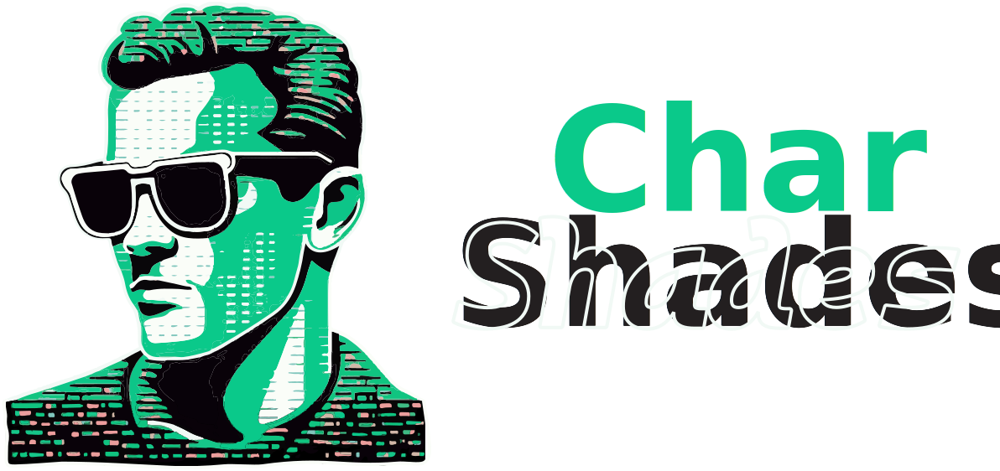

# CharShades - ASCII Art Converter

Convert images into ASCII art.

> **Warning**
> This project is still in early development and has very limited functionality.
> The idea is to keep developing it in the open.
> Contributions are welcome!

## Features

- Convert any image to ASCII art
- Specify the width and height of the output
- Invert the colors of the output (grayscale)
- Save the output to a file
- Suppress stdout output for silent operation

## Usage

To use the application, you need to provide a file to convert and specify the width and height of the output.

Here's an example command:

```bash
cargo run -- image.png --width 80 --height 40
```

This will convert the image `image.png` to ASCII art with a width of 80 characters and a height of 40 characters. The ASCII art will be printed to stdout.

If you want to invert the colors of the output, you can use the `--invert` (or `-i`) flag:

```bash
cargo run -- image.png -W 80 -H 40 --invert
```

If you want to save the output to a file instead of printing it to stdout, you can use the `--output` (or `-o`) option:

```bash
cargo run -- image.png -W 80 -H 40 --output output.txt
```

This will save the ASCII art to `output.txt`. If you also want to suppress stdout output, you can use the `--quiet` (or `-q`) flag:

```bash
cargo run -- image.png -W 80 -H 40 --output output.txt --quiet
```

This will save the ASCII art to `output.txt` and suppress stdout output.
